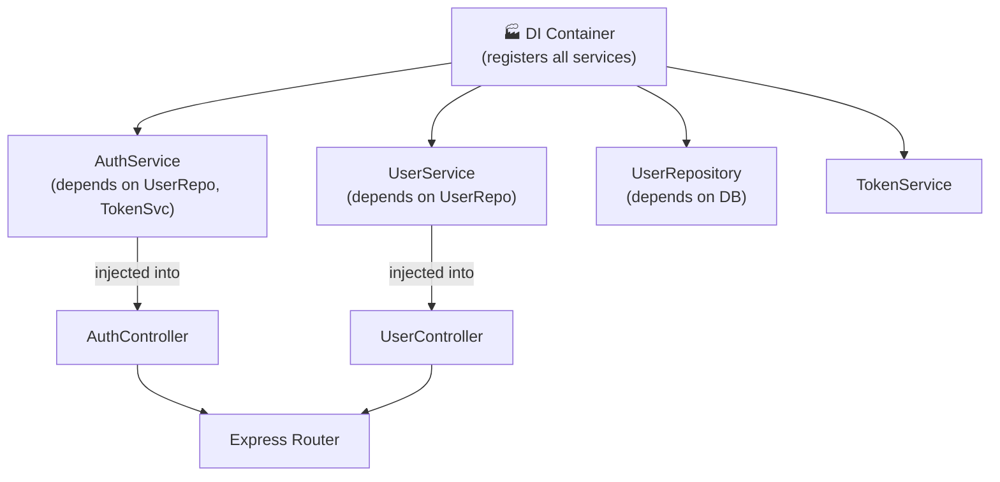

# Dependency Injection in Node.js + Express

<p align="center">
  
  
  
  
  
</p>

A clean **Dependency Injection (DI) / Inversion of Control (IoC) boilerplate** for Node.js + Express, following SOLID principles. Decouples service construction from usage — making your code testable, modular, and scalable without a heavy framework.

---

## 🧩 DI Pattern



---

## 🚀 Quick Start

```bash
npm install
cp .env.example .env
npm run dev
```

---

## 📁 Project Structure

```
src/
├── container.js          # DI container (wires all dependencies)
├── controllers/          # Thin controllers — receive injected services
├── services/             # Business logic — injected via constructor
├── repositories/         # Data layer — injected DB/ORM adapter
├── routes/               # Express routers
└── app.js
```

---

## 🧪 Testing with DI

Because dependencies are injected, mocking is trivial:

```js
const mockUserRepo = { findById: jest.fn().mockResolvedValue(fakeUser) };
const service = new UserService(mockUserRepo);

const result = await service.getUser('123');
expect(result).toEqual(fakeUser);
```

---

## 📐 Design Principles

| Principle | How |
|-----------|-----|
| **Single Responsibility** | Each class does one thing |
| **Dependency Inversion** | High-level modules don't depend on low-level ones |
| **Open/Closed** | Add new services without modifying existing ones |
| **Testability** | All dependencies mockable via constructor injection |

---

## 📄 License

MIT
